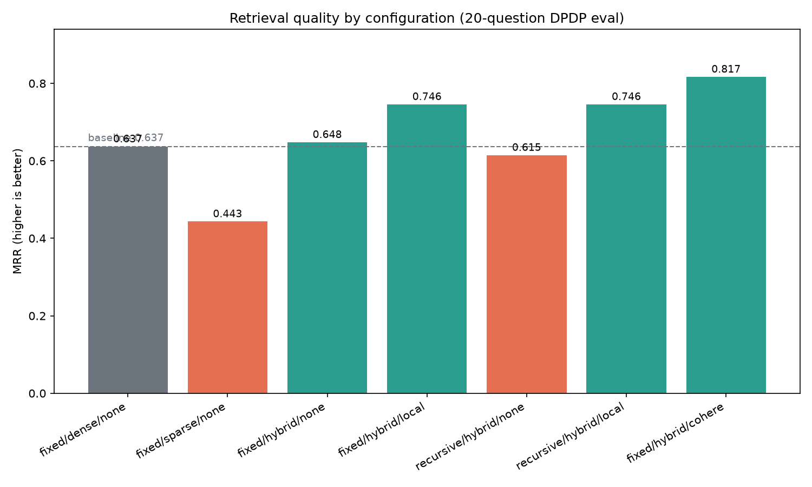

# search-lab

A retrieval-evaluation harness over the **Digital Personal Data Protection (DPDP) Act, 2023**. It indexes the Act's text under interchangeable retrieval strategies and measures retrieval quality quantitatively against a fixed, hand-labeled question set, so that chunking, search-mode, and reranking choices can be made on evidence rather than assumption.

The system supports two chunking strategies, three search modes, and two rerankers, evaluated in any combination. Results are reported as Mean Reciprocal Rank (MRR) and Hit@{1,3,5} per configuration.

## Pipeline

1. **Ingestion** — the DPDP Act PDF is parsed into per-page text with character-level provenance.
2. **Chunking** — two strategies, sized in token space: fixed-size token windows and recursive (separator-aware) splitting.
3. **Embedding** — chunks are embedded locally with `all-MiniLM-L6-v2` and persisted to Chroma.
4. **Retrieval** — dense (vector similarity), sparse (BM25 via OpenSearch), and hybrid (Reciprocal Rank Fusion of the two).
5. **Reranking** — optional, via a local cross-encoder (`ms-marco-MiniLM`) or Cohere `rerank-v3.5`.
6. **Evaluation** — every configuration is scored against a 20-question golden set with labeled answer spans.

## Results

20-question golden set, relevance threshold `min_coverage = 0.5`. The baseline is `fixed/dense/none`; **dMRR** is each configuration's MRR relative to it.

| Config | MRR | Hit@1 | Hit@3 | Hit@5 | dMRR |
|---|---|---|---|---|---|
| fixed/dense/none | 0.637 | 0.500 | 0.750 | 0.850 | baseline |
| fixed/sparse/none | 0.443 | 0.300 | 0.450 | 0.650 | −0.193 |
| fixed/hybrid/none | 0.648 | 0.550 | 0.650 | 0.850 | +0.011 |
| fixed/hybrid/local | 0.746 | 0.650 | 0.850 | 0.900 | +0.109 |
| recursive/hybrid/none | 0.615 | 0.450 | 0.750 | 0.850 | −0.022 |
| recursive/hybrid/local | 0.746 | 0.650 | 0.850 | 0.900 | +0.109 |
| fixed/hybrid/cohere | **0.817** | **0.750** | **0.900** | **0.900** | **+0.180** |



## Findings

**Reranking is the dominant lever.** A reranker moved MRR substantially more than any retrieval-mode change: +0.109 (local) to +0.180 (Cohere), against +0.011 for hybrid over dense. Reranking yields the largest single improvement available in this pipeline.

**Cohere outperforms the local cross-encoder, but the local model recovers most of the gain at no cost.** Cohere `rerank-v3.5` (0.817) exceeds the local cross-encoder (0.746) by 0.071 MRR — above the ~0.05 noise floor at this sample size, and therefore a real difference. The local model nonetheless captures roughly 60% of the total available reranking gain with no API cost or network dependency. The trade-off is incremental accuracy against operational cost and latency, not a categorical win.

**Hybrid retrieval does not improve on dense for this corpus.** Fusing BM25 into dense retrieval without a reranker changed MRR by +0.011, and slightly regressed under recursive chunking (−0.022). Hybrid retrieval only produced gains once a reranker was applied on top of it.

**Sparse retrieval was the weakest mode (−0.193) under this query distribution.** Legal text exhibits a wide lexical gap between user phrasing and statutory language ("delete my data" versus "erasure"). BM25 matches terms rather than meaning and cannot bridge that gap. This reflects the query distribution rather than a limitation of BM25 in general (see Limitations).

**Chunking strategy had no measurable effect.** Fixed and recursive chunking produced identical MRR (0.746) on the reranked configurations and differences within noise elsewhere. For this corpus, chunker choice was not a meaningful determinant of retrieval quality.

## Design decisions

**Relevance is labeled by source span, not by chunk ID.** The two chunkers produce different chunk boundaries and IDs, so a golden set keyed to chunk IDs would be valid for only one of them. Each answer is instead labeled by its location in the source document — `(page, char_start, char_end)` — and relevance is determined by character-span overlap. A single golden set therefore scores any chunking strategy, which is a prerequisite for comparing them directly. This also aligns with a source-traceability requirement carried forward to downstream work.

**Relevance uses a coverage threshold.** A retrieved chunk is counted relevant when it covers at least 50% of a labeled answer span on the same page. Coverage was chosen over any-overlap (too permissive — a single shared character would qualify) and over Intersection-over-Union (which penalizes a chunk for exceeding the answer span, a property that is not relevant to retrieval). The threshold is a configurable parameter.

**Metrics are deterministic; no LLM judge and no third-party eval framework are used.** This harness evaluates retrieval, which produces no generated text to judge — MRR and Hit@k are rank computations over hand-labeled spans. General-purpose RAG evaluation frameworks were declined because they target generation quality through an LLM-as-judge and obscure direct inspection of retrieved results, where domain-specific failure modes (for example, a chunk that severs a clause mid-sentence) are visible.

**Chunks are sized in token space with exact provenance.** Chunk size is measured by the embedding model's own tokenizer (target 240 tokens, within the 256-token limit after reserved special tokens), and each chunk's character offsets are recovered from the tokenizer's offset mapping so that provenance refers to the verbatim source text rather than a detokenized approximation.

**Hybrid fusion is performed explicitly in the application layer.** Dense (Chroma) and sparse (OpenSearch BM25) results are combined with Reciprocal Rank Fusion (k = 60) rather than delegated to a hybrid-native store, keeping the fusion logic explicit and independent of any single backend.

**Score conventions are normalized to higher-is-better per mode.** Dense scores are reported as `1 - cosine_distance`; sparse scores are raw BM25, compared only within a list or by rank in fusion; hybrid scores are RRF values. Cross-mode score magnitudes are never compared, so the differing scales are intentional.

## Limitations

**The query set is predominantly question-form.** Eighteen of twenty queries are well-formed natural-language questions; two are keyword fragments. Production retrieval traffic contains a higher proportion of terse or fragmentary queries, where BM25's exact-match behavior is more effective. The sparse-retrieval results here are therefore a lower bound for lexical retrieval; under a fragment-heavy distribution, hybrid retrieval would likely show a larger advantage over dense. A per-query-style breakdown would quantify this but requires a larger evaluation set.

**The penalty Schedule is excluded from the golden set.** The Act's penalty table (page 21) does not survive PDF extraction as contiguous text — row numbers, the column header, and the monetary amounts are separated into detached fragments, leaving no coherent answer span to label. Two candidate questions targeting it were removed and replaced with prose-section equivalents. Table extraction is a distinct problem from retrieval quality and is out of scope.

**A single embedding model was evaluated.** Only `all-MiniLM-L6-v2` was run. Comparison against a stronger embedding model (for example, BGE-small or Qwen3-0.6B) is left as future work.

**Sample size is small.** With twenty questions, each query contributes approximately 0.05 to MRR. Differences above ~0.05 are treated as directional signal rather than statistically established results.

## Setup

Requires Python 3.11, [uv](https://github.com/astral-sh/uv), and Docker (for OpenSearch).

```bash
uv sync

# OpenSearch provides the BM25 backend (local, security plugin disabled)
docker start opensearch   # or run a fresh container on port 9200

# Optional: Cohere reranker requires an API key in .env
echo "COHERE_API_KEY=..." > .env
```

## Usage

```bash
# 1. Parse and chunk the PDF (both strategies)
uv run python -m search_lab.ingest

# 2. Embed and index into Chroma
uv run python -m search_lab.embed

# 3. Index the same chunks into OpenSearch for BM25
uv run python -m search_lab.search.index_opensearch

# 4. Run the evaluation - prints the comparison table and writes eval_results.png
uv run python -m search_lab.eval
```

Supporting tools:

```bash
# Per-query diagnostics: first-relevant rank and coverage percentage, for label verification
uv run python -m search_lab.eval.debug_eval

# Locate a phrase's per-page character span when authoring a golden-set entry
uv run python -m search_lab.eval.find_span --phrase "your phrase" --page 7 --ignore-case
```

## Configurable parameters

Every stage exposes its levers as parameters rather than hard-coding them, so configurations can be varied without modifying the source.

| Stage | Parameter | Where | Effect |
|---|---|---|---|
| Chunking | `chunk_size`, `overlap` | `fixed_size_chunker`, `recursive_chunker` | Token-space window size and overlap |
| Chunking | `content_budget` | both chunkers | Hard token ceiling enforced per chunk |
| Retrieval | `mode` | `Retriever.search` | `SearchMode.DENSE` / `SPARSE` / `HYBRID` |
| Retrieval | `top_k` | `Retriever.search` | Number of results returned |
| Retrieval | `fetch_depth` | `Retriever.search` | Candidate depth pulled from each mode before RRF |
| Fusion | `RRF_K` | `search/retriever.py` | Reciprocal Rank Fusion constant (default 60) |
| Reranking | `model_name` | `LocalReranker`, `CohereReranker` | Cross-encoder / Cohere model identifier |
| Reranking | `throttle_s` | `CohereReranker` | Inter-call delay for rate-limited keys (default 0) |
| Evaluation | `min_coverage` | `run_eval` | Span-coverage threshold for relevance (default 0.5) |
| Evaluation | `k_values` | `run_eval` | Which Hit@k cutoffs to compute (default `[1, 3, 5]`) |
| Evaluation | `top_k` | `run_eval` | Retrieval depth scored per query |

## Running custom evaluations

The evaluation harness is callable directly. A configuration is an `EvalConfig` binding a `Retriever`, a search mode, and an optional reranker; `run_eval` scores an ordered list of them (the first is treated as the baseline) and returns `EvalResult` objects.

```python
import chromadb
from search_lab.embed.models import EmbedModelSpec
from search_lab.embed.store import collection_name_for
from search_lab.search.index_opensearch import get_client, index_name_for
from search_lab.search.retriever import Retriever
from search_lab.search.modes import SearchMode
from search_lab.rerank.local import LocalReranker
from search_lab.eval.golden import load_golden_set
from search_lab.eval.runner import EvalConfig, run_eval, format_table
from search_lab.eval.plot import plot_mrr

# Build a retriever bound to one chunking strategy's indexes
embed_spec = EmbedModelSpec("all-MiniLM-L6-v2")
chroma = chromadb.PersistentClient(path="chroma")
retriever = Retriever(
    collection=chroma.get_collection(
        name=collection_name_for("dpdp", "fixed", "all-MiniLM-L6-v2")
    ),
    embed_spec=embed_spec,
    os_client=get_client(),
    os_index=index_name_for("dpdp", "fixed"),
)

# Define the configurations to compare (first = baseline)
configs = [
    EvalConfig("dense", retriever, SearchMode.DENSE),
    EvalConfig("hybrid", retriever, SearchMode.HYBRID),
    EvalConfig("hybrid+local", retriever, SearchMode.HYBRID, LocalReranker()),
]

# Score against the golden set, with custom thresholds if desired
queries = load_golden_set("search_lab/eval/golden_set.json")
results = run_eval(configs, queries, k_values=[1, 5, 10], min_coverage=0.4, top_k=10)

print(format_table(results, k_values=[1, 5, 10], min_coverage=0.4))
plot_mrr(results, "eval_results.png")
```

A single retrieval, without the evaluation layer, is one call:

```python
hits = retriever.search("rights of a data principal", mode=SearchMode.HYBRID, top_k=10)
reranked = LocalReranker().rerank("rights of a data principal", hits, top_k=10)
```

To evaluate a **new corpus or question set**, supply a `golden_set.json` whose entries are `{qid, query, relevant: [{page, char_start, char_end}], note?}`; `find_span` locates the spans, and `debug_eval` verifies each query resolves to a labeled chunk before a full run.

## Architecture

```
search_lab/
├── ingest/    PDF loader (per-page text + provenance), two chunkers, Chunk model, domain errors
├── embed/     EmbedModelSpec (tokenizer/model binding), Chroma store and indexing
├── search/    Retriever with unified search(mode) over dense/sparse/hybrid; OpenSearch BM25 indexer
├── rerank/    Reranker ABC, local cross-encoder, Cohere reranker (composed by the caller)
└── eval/      golden_set.json, metrics, runner, chart generator, find_span, debug_eval
```

Key boundaries:

- **Retrieval and reranking are independent stages.** The caller composes `retriever.search(...)` then `reranker.rerank(...)`; reranking is not embedded inside retrieval, so each stage is tested and evaluated separately.
- **A single chunk set is the source of truth for both backends.** Chunks indexed into Chroma are read back out and indexed into OpenSearch, ensuring dense and sparse retrieval operate over identical units.
- **All retrieval modes return a uniform `SearchResult`** (id, text, score, rank, page, character span, strategy, mode, reranker), so the evaluation layer treats every configuration identically.

## Stack

Python 3.11 · uv · sentence-transformers (`all-MiniLM-L6-v2`) · Chroma · OpenSearch 3.x (BM25) · Cohere `rerank-v3.5` · Pydantic v2 · structlog · matplotlib